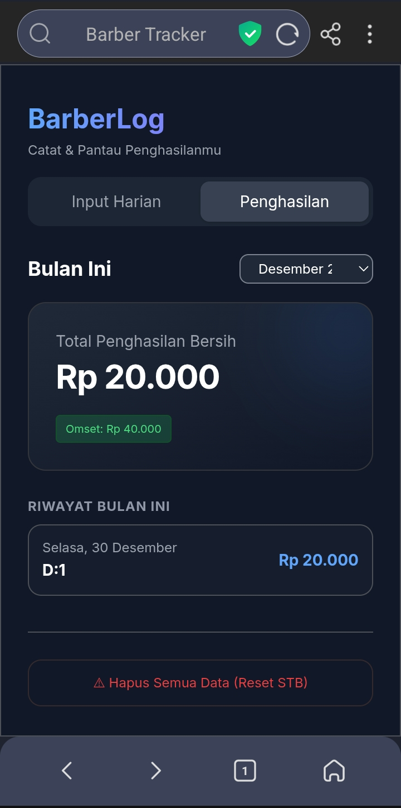

**BARBER TRACK INCOME APP NodeJS & ExpressJs BASED**


✍🏻  by Fahrul Hamzidan Pulungan 


, 


**Cara Instalasi & Running App**

Clonning repo ini ke VPS atau STB kalian di terminal dengan cara salin perintah di bawah ini:

```git clone https://github.com/z1dan820/barber-app.git```

Selanjutnya setelah ter clone, berikan perintah ini:

```npm install```

dan jalankan app dengan ini:

```npm start```

**Cara agar app berjalan di latar belakang dan otomatis nyala saar STB REboot**

Buka Terminal di STB kamu dan install PM2 dengan perintah di bawah ini:

```npm install pm2 -g```

masuk ke folder app nya dan jalankan perintah ini:

```pm2 start server.js --name "barber-app"```
sekarang app telah berjalan di latar belakang STB

kemudian ini bagian paling penting setup PM2 dengan perintah ini:

```pm2 startup```

kemudian simpan setup:

```pm2 save```

maka app akan nyala otomatis saat stb di reboot


cara memberhentikan app dari PM2:
```pm2 delete barber-app```


cara menghapus app dari daftar PM2:
```pm2 delete barber-app```
